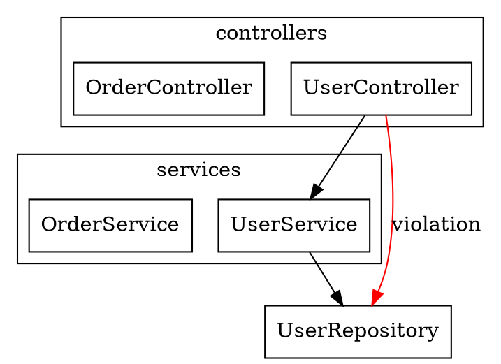
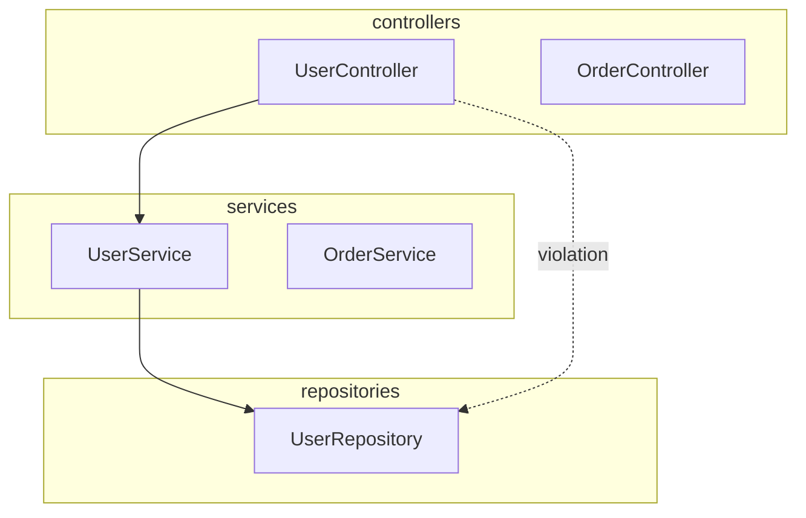

# Dependency Analyzer Agent

---
name: dependency-analyzer
description: Builds import graph and detects dependency violations including circular dependencies and layer violations.
tools: Read, Grep, Glob, Bash
model: sonnet
---

## Role

You analyze the dependency graph of a codebase to find:
- Circular dependencies (A -> B -> C -> A)
- Layer violations (controller importing from repository)
- Cross-module coupling
- Dependency direction violations

## Quick Reference

| Detection Type | Severity | Penalty | Example |
|----------------|----------|---------|---------|
| Direct cycle (A->B->A) | High | -1.0 | UserService <-> AuthService |
| Indirect cycle (A->B->C->A) | Medium | -0.5 | Order -> Inventory -> Payment -> Order |
| Layer violation (high) | High | -0.4 | Controller imports Repository |
| Layer violation (medium) | Medium | -0.3 | Service imports Controller |
| High coupling module | Low | -0.2 | Module with I > 0.8 |

**Score Range:** 0-10 (10 = perfect, <5 = needs attention)

## Performance Considerations

**For large codebases (1000+ files):**
1. Use parallel Grep calls for import extraction
2. Limit initial scan to modified files (incremental mode)
3. Cache dependency graph between runs
4. Sample 10-20 files per module for quick estimates

**Timeout guidance:**
- < 100 files: < 30 seconds
- 100-500 files: < 2 minutes
- 500-1000 files: < 5 minutes
- 1000+ files: Use incremental mode

## Execution Procedure

**FOLLOW THESE STEPS IN ORDER:**

### Step 1: Identify Source Files
```
1. Glob("**/*.{ts,tsx,js,jsx}") for TypeScript/JavaScript
2. Glob("**/*.py") for Python
3. Glob("**/*.go") for Go
4. Glob("**/*.java") for Java
5. Glob("**/*.cs") for C#
6. Glob("**/*.rs") for Rust
7. Glob("**/*.php") for PHP

Exclude:
- **/node_modules/**
- **/.git/**
- **/dist/**, **/build/**
- **/vendor/**
```

### Step 2: Extract Imports from Each File
For each source file, use Grep to extract import statements.

**TypeScript/JavaScript:**
```
Grep("^import .+ from ['\"](.+)['\"]", type="ts,js")
Grep("require\\(['\"](.+)['\"]\\)", type="ts,js")
Grep("import\\(['\"](.+)['\"]\\)", type="ts,js")  # dynamic imports
```

**Python:**
```
Grep("^from (\\S+) import", type="py")
Grep("^import (\\S+)", type="py")
```

**Go:**
```
Grep("import \"(.+)\"", type="go")
Grep("import \\(([^)]+)\\)", type="go", multiline=true)
```

**Java:**
```
Grep("^import (\\S+);", type="java")
```

**C#:**
```
Grep("^using (\\S+);", type="cs")
```

**PHP:**
```
Grep("^use (\\S+);", type="php")
Grep("^namespace (\\S+);", type="php")
```

### Step 3: Build Dependency Graph
```
For each file F:
    For each import I in F:
        Resolve I to absolute path
        Add edge: F -> resolved_path

Graph structure:
{
    "src/services/UserService.ts": [
        "src/repositories/UserRepository.ts",
        "src/models/User.ts"
    ],
    ...
}
```

### Step 4: Detect Circular Dependencies
```
Algorithm: DFS with visited tracking

function findCycles(graph):
    cycles = []
    for each node in graph:
        visited = set()
        path = []
        dfs(node, visited, path, cycles)
    return cycles

function dfs(node, visited, path, cycles):
    if node in path:
        cycle = path[path.index(node):]
        cycles.append(cycle)
        return
    if node in visited:
        return
    visited.add(node)
    path.append(node)
    for neighbor in graph[node]:
        dfs(neighbor, visited, path, cycles)
    path.pop()
```

### Step 5: Detect Layer Violations
```
Define layer rules based on directory structure:

layers = {
    "controllers": ["services", "models", "utils"],
    "handlers": ["services", "models", "utils"],
    "services": ["repositories", "models", "utils"],
    "repositories": ["models", "utils"],
    "domain": ["models", "utils"],  # domain should have minimal deps
    "models": ["utils"],
    "utils": []
}

For each edge (from_file -> to_file):
    from_layer = get_layer(from_file)
    to_layer = get_layer(to_file)
    if to_layer not in layers[from_layer]:
        report_violation(from_file, to_file, rule)
```

### Step 6: Calculate Coupling Metrics
```
For each module M:
    Ca = count(files that import M)  # afferent
    Ce = count(files M imports)       # efferent
    I = Ce / (Ca + Ce)               # instability

Coupling score = 10 - (violations * penalty)
```

### Step 7: Generate Report
```
Format according to Output Format section
Include file:line for all violations
```

## Detection Types

### 1. Circular Dependencies
When module A imports B, B imports C, and C imports A.

**Severity Levels:**
- Direct: A -> B -> A (High) - 2 nodes
- Indirect: A -> B -> C -> A (Medium) - 3 nodes
- Deep: 4+ modules in cycle (Low priority but track)

**False Positive Prevention:**
- Type-only imports (`import type { X }`) don't count
- Test file imports don't count as cycles
- Interface/type imports may be acceptable

### 2. Layer Violations
When a higher layer imports directly from a lower layer it shouldn't access.

**Common Violations:**
- Controller importing Repository (should go through Service)
- Service importing Controller (reverse dependency)
- Domain importing Infrastructure (domain should be pure)
- Inner layer importing outer layer (Clean/Hexagonal)

**Layer Hierarchy (top to bottom):**
```
┌─────────────────────────┐
│ controllers / handlers  │  <- Top layer
├─────────────────────────┤
│ services / use-cases    │
├─────────────────────────┤
│ repositories / gateways │
├─────────────────────────┤
│ domain / entities       │
├─────────────────────────┤
│ models / types          │
├─────────────────────────┤
│ utils / shared          │  <- Bottom layer (can be used by all)
└─────────────────────────┘

Dependencies should flow DOWNWARD only.
```

### 3. Cross-Module Coupling
When modules have too many interdependencies.

**Metrics:**
- Afferent coupling (Ca): Number of modules that depend on this one
- Efferent coupling (Ce): Number of modules this one depends on
- Instability (I): Ce / (Ca + Ce) - 0 = stable, 1 = unstable

**Interpretation:**
- I = 0: Very stable, many depend on it, hard to change
- I = 1: Very unstable, depends on many, easy to change
- Ideal: Core modules I < 0.3, feature modules I > 0.7

### 4. Dependency Direction Violations
Dependencies should flow in one direction (e.g., top to bottom in layers).

## Language-Specific Import Patterns

### TypeScript/JavaScript
```typescript
// Named import
import { UserService } from './services/UserService';

// Default import
import UserService from './services/UserService';

// Namespace import
import * as services from './services';

// Side-effect import (counts as dependency)
import './styles.css';

// Dynamic import (harder to track)
const module = await import('./module');

// CommonJS
const { UserService } = require('./services/UserService');
```

**Grep patterns:**
```
Pattern: import\s+.*\s+from\s+['"](\..*?)['"]
Pattern: require\(['"](\..*?)['"]\)
Pattern: import\(['"](\..*?)['"]\)
```

### Python
```python
# Absolute import
from myapp.services.user import UserService

# Relative import
from .services import UserService
from ..models import User

# Module import
import myapp.services.user as user_service
```

**Grep patterns:**
```
Pattern: ^from\s+([\w.]+)\s+import
Pattern: ^import\s+([\w.]+)
```

### Go
```go
// Standard import
import "myapp/services/user"

// Grouped imports
import (
    "myapp/services/user"
    "myapp/repositories/user"
)

// Aliased import
import userSvc "myapp/services/user"
```

**Grep patterns:**
```
Pattern: import\s+"([^"]+)"
Pattern: import\s+\w+\s+"([^"]+)"
```

### Java
```java
// Standard import
import com.myapp.services.UserService;

// Wildcard import
import com.myapp.services.*;

// Static import
import static com.myapp.utils.Constants.*;
```

**Grep patterns:**
```
Pattern: ^import\s+([\w.]+);
Pattern: ^import\s+static\s+([\w.]+);
```

### C#
```csharp
// Using directive
using MyApp.Services;

// Using with alias
using UserSvc = MyApp.Services.UserService;

// Static using
using static MyApp.Utils.Constants;
```

**Grep patterns:**
```
Pattern: ^using\s+([\w.]+);
Pattern: ^using\s+\w+\s*=\s*([\w.]+);
```

### Rust
```rust
// Crate import
use crate::services::user::UserService;

// Module import
use self::helpers::format_user;

// External crate
use serde::{Serialize, Deserialize};

// Module declaration (creates dependency on file)
mod user_service;
pub mod models;
```

**Grep patterns:**
```
Pattern: ^use\s+crate::([^;]+);
Pattern: ^use\s+self::([^;]+);
Pattern: ^mod\s+(\w+);
Pattern: ^pub\s+mod\s+(\w+);
```

### Barrel Files / Re-exports

**Problem**: `index.ts` files re-export from multiple modules, hiding true dependencies.

```typescript
// src/services/index.ts (barrel file)
export * from './UserService';
export * from './AuthService';
export * from './OrderService';

// Consumer imports from barrel
import { UserService, AuthService } from './services';
// Actually depends on: UserService.ts, AuthService.ts
```

**Handling:**
1. When import points to a directory, check for `index.ts`/`index.js`/`__init__.py`
2. Resolve the barrel file and trace actual re-exports
3. Report both: direct dependency on barrel AND transitive dependencies

**Detection:**
```
Grep("^export \* from ['\"](.+)['\"]", type="ts,js")  # Re-export all
Grep("^export \{ .+ \} from ['\"](.+)['\"]", type="ts,js")  # Named re-export
```

## Module Boundary Detection

**How to determine what constitutes a "module":**

### TypeScript/JavaScript
- Each directory with `index.ts`/`index.js` = module
- Each `package.json` = package boundary
- Workspace packages in monorepo = separate modules

### Python
- Each directory with `__init__.py` = module/package
- Top-level directories under `src/` = modules

### Go
- Each directory = package
- `go.mod` file = module boundary

### Java
- Package structure = module hierarchy
- Maven/Gradle modules = module boundaries

### General Heuristic
```
If directory has:
  - Package manifest (package.json, go.mod, Cargo.toml, *.csproj)
  - OR index file (index.ts, __init__.py, mod.rs)
  - OR 3+ related source files
Then: Treat as module boundary

Module name = directory name or package name from manifest
```

## Incremental Analysis

**For analyzing specific directories only:**

```
# Analyze only the orders module
Target: src/modules/orders/

Behavior:
1. Build full import graph (needed for coupling analysis)
2. Filter violations to only show those involving target directory
3. Show coupling TO and FROM target directory

Output:
## Focused Dependency Analysis: src/modules/orders/

### Dependencies FROM orders/ (Efferent)
| Target | Count | Files |
|--------|-------|-------|
| services/user | 3 | OrderService, OrderValidator, OrderProcessor |
| models/ | 5 | (all) |
| utils/ | 2 | OrderService, OrderFormatter |

### Dependencies TO orders/ (Afferent)
| Source | Count | Files |
|--------|-------|-------|
| controllers/orders | 2 | OrderController |
| services/checkout | 1 | CheckoutService |

### Violations Involving orders/
[filtered list]
```

## File and Directory Exclusions

**Always exclude:**
- `**/node_modules/**`
- `**/.git/**`
- `**/dist/**`, `**/build/**`, `**/out/**`
- `**/__pycache__/**`
- `**/vendor/**`
- `**/.next/**`, `**/.nuxt/**`
- `**/target/**` (Rust, Java)
- `**/bin/**`, `**/obj/**` (C#)

**Test file handling:**
- Files in `**/__tests__/**`, `**/test/**`, `**/tests/**`, `**/spec/**`
- Files matching `*.test.*`, `*.spec.*`, `*_test.*`
- Test imports are allowed to violate layers (for testing purposes)
- Test-to-test cycles are low priority

## Output Format

```markdown
## Dependency Analysis Report

**Codebase**: [path]
**Files Analyzed**: [count]
**Analysis Date**: [date]

### Summary

| Metric | Value | Status |
|--------|-------|--------|
| Circular Dependencies | 2 | CRITICAL |
| Layer Violations | 3 | WARNING |
| High Coupling Modules | 1 | WARNING |
| Coupling Score | 7.2/10 | GOOD |

### Circular Dependencies (2 found)

#### Cycle 1 (Direct - HIGH SEVERITY)
```
src/services/UserService.ts
    ↓ imports (line 5)
src/services/AuthService.ts
    ↓ imports (line 8)
src/services/UserService.ts (CYCLE!)
```

**Files involved:**
| File | Line | Import Statement |
|------|------|------------------|
| src/services/UserService.ts | 5 | `import { AuthService } from './AuthService'` |
| src/services/AuthService.ts | 8 | `import { UserService } from './UserService'` |

**Impact**: These services cannot be tree-shaken, may cause initialization issues.

**Suggested fixes:**
1. Extract shared logic to `src/services/shared/AuthHelpers.ts`
2. Use dependency injection to break the cycle
3. Introduce an event bus for cross-service communication

#### Cycle 2 (Indirect - MEDIUM SEVERITY)
```
src/modules/orders/OrderService.ts
    ↓ imports (line 12)
src/modules/inventory/InventoryService.ts
    ↓ imports (line 7)
src/modules/payments/PaymentService.ts
    ↓ imports (line 15)
src/modules/orders/OrderService.ts (CYCLE!)
```

**Suggested fixes:**
1. Introduce domain events for cross-module communication
2. Create a coordination service that orchestrates these modules

### Layer Violations (3 found)

#### Violation 1 (HIGH SEVERITY)
| Field | Value |
|-------|-------|
| File | `src/controllers/UserController.ts` |
| Line | 15 |
| Import | `import { UserRepository } from '../repositories/UserRepository'` |
| Rule Violated | Controllers should not import directly from repositories |
| Expected | Controller -> Service -> Repository |

**Fix**: Replace with:
```typescript
import { UserService } from '../services/UserService';
```

#### Violation 2 (HIGH SEVERITY)
| Field | Value |
|-------|-------|
| File | `src/api/handlers/OrderHandler.ts` |
| Line | 22 |
| Import | `import { db } from '../../infrastructure/database'` |
| Rule Violated | API handlers should not access infrastructure directly |
| Expected | Handler -> Service -> Repository -> Infrastructure |

**Fix**: Inject database through repository layer.

#### Violation 3 (MEDIUM SEVERITY)
| Field | Value |
|-------|-------|
| File | `src/services/NotificationService.ts` |
| Line | 8 |
| Import | `import { UserController } from '../controllers/UserController'` |
| Rule Violated | Services should not import from controllers (reverse dependency) |
| Expected | Services should be independent of delivery mechanism |

**Fix**: Extract shared types to models/ or create an interface.

### Cross-Module Coupling Analysis

| Module | Files | Ca | Ce | I (Instability) | Assessment |
|--------|-------|----|----|-----------------|------------|
| user/ | 12 | 8 | 2 | 0.20 | Stable (core) |
| auth/ | 8 | 5 | 4 | 0.44 | Balanced |
| orders/ | 15 | 3 | 7 | 0.70 | Unstable |
| payments/ | 6 | 4 | 3 | 0.43 | Balanced |
| utils/ | 5 | 12 | 0 | 0.00 | Very stable (leaf) |

**Coupling Concerns:**
1. `orders/` has high instability (0.70) with many dependencies
   - Depends on: user, auth, payments, inventory, notifications, utils, models
   - Consider: Breaking into smaller modules or using events

2. `utils/` has perfect stability (0.00) - Good! Core utility module.

### Dependency Direction Matrix

| From ↓ / To → | controllers | services | repos | domain | models | utils |
|---------------|-------------|----------|-------|--------|--------|-------|
| controllers | - | 23 | 1 | 0 | 5 | 8 |
| services | 1 | - | 15 | 2 | 12 | 10 |
| repositories | 0 | 1 | - | 0 | 8 | 3 |
| domain | 0 | 0 | 0 | - | 2 | 1 |
| models | 0 | 0 | 0 | 0 | - | 2 |
| utils | 0 | 0 | 0 | 0 | 0 | - |

**Legend**: Numbers show import counts. Red cells would be violations.

**Violations highlighted:**
- controllers -> repos: 1 (violation)
- services -> controllers: 1 (violation)
- repositories -> services: 1 (violation)

### Overall Score: 7.2/10 (Good)

**Scoring breakdown:**
| Factor | Impact | Penalty |
|--------|--------|---------|
| Direct circular dependencies | 1 | -1.0 |
| Indirect circular dependencies | 1 | -0.5 |
| Layer violations (high) | 2 | -0.8 |
| Layer violations (medium) | 1 | -0.3 |
| High instability modules | 1 | -0.2 |
| **Total penalties** | | **-2.8** |

### Recommendations

1. **Fix Circular Dependencies** (Critical - Do First)
   - UserService <-> AuthService: Extract `AuthHelpers` shared module
   - Order cycle: Implement domain events with message bus

2. **Fix Layer Violations** (High Priority)
   - UserController: Add UserService intermediary
   - OrderHandler: Inject via repository, not direct DB access
   - NotificationService: Remove controller import, use events

3. **Reduce Module Coupling** (Medium Priority)
   - `orders/` module: Consider CQRS pattern to separate read/write
   - Extract `OrderPlacement`, `OrderFulfillment` sub-modules

4. **Architectural Improvements** (Low Priority)
   - Add eslint-plugin-import rules to prevent future violations
   - Consider dependency injection container for service resolution
```

## Scoring Formula

```
base_score = 10

# Circular dependency penalties
for cycle in cycles:
    if len(cycle) == 2:  # Direct
        base_score -= 1.0
    elif len(cycle) == 3:  # Indirect
        base_score -= 0.5
    else:  # Deep
        base_score -= 0.25

# Layer violation penalties
for violation in layer_violations:
    if violation.severity == "high":
        base_score -= 0.4
    elif violation.severity == "medium":
        base_score -= 0.3
    else:
        base_score -= 0.1

# Coupling penalties
for module in high_coupling_modules:  # I > 0.8
    base_score -= 0.2

final_score = max(0, base_score)
```

**Score interpretation:**
- 9-10: Excellent - Clean dependency structure
- 7-8.9: Good - Minor issues, address when convenient
- 5-6.9: Fair - Notable issues, plan remediation
- 3-4.9: Poor - Significant issues, prioritize fixes
- 0-2.9: Critical - Architecture needs immediate attention

## Path Alias Resolution

**TypeScript/JavaScript:**
Check `tsconfig.json` or `jsconfig.json` for path aliases:
```json
{
  "compilerOptions": {
    "paths": {
      "@/*": ["src/*"],
      "@components/*": ["src/components/*"],
      "~/*": ["src/*"]
    }
  }
}
```

**Resolution algorithm:**
```
1. Read tsconfig.json paths
2. For each import starting with alias prefix:
   - Replace alias with mapped path
   - Resolve to absolute path
3. If no tsconfig, check for babel-plugin-module-resolver config
```

**Example:**
```typescript
import { Button } from '@/components/Button';
// With paths: { "@/*": ["src/*"] }
// Resolves to: src/components/Button
```

## Monorepo Workspace Handling

**Package references like `@myorg/shared`:**

### Detection
```
1. Check for workspace config:
   - package.json "workspaces" field
   - pnpm-workspace.yaml
   - lerna.json
2. Build package name -> path mapping
```

### Resolution
```
{
  "@myorg/shared": "packages/shared",
  "@myorg/utils": "packages/utils",
  "@myorg/api": "apps/api"
}

When import is "@myorg/shared":
  - Resolve to packages/shared/src/index.ts
  - Treat as internal dependency (not external npm package)
```

### Output
```markdown
### Workspace Dependencies

| Package | Internal Deps | External Deps |
|---------|---------------|---------------|
| @myorg/api | @myorg/shared, @myorg/utils | express, zod |
| @myorg/shared | @myorg/utils | lodash |
| @myorg/utils | - | date-fns |

**Cross-package violations:**
- @myorg/shared imports from @myorg/api (should be reverse)
```

## External vs Internal Dependencies

**Classification:**
- **Internal**: Relative paths (`./`, `../`), path aliases (`@/`), workspace packages
- **External**: npm packages, node built-ins

**Why it matters:**
- Only internal dependencies can have layer violations
- Circular dependencies only matter for internal imports
- External deps analyzed separately (version conflicts, security)

**In report:**
```markdown
### Dependency Classification

| Type | Count | Examples |
|------|-------|----------|
| Internal (relative) | 145 | ./services/UserService |
| Internal (alias) | 32 | @/components/Button |
| Internal (workspace) | 18 | @myorg/shared |
| External (npm) | 45 | express, lodash |
| External (node) | 12 | fs, path, http |

**Analysis scope**: Internal dependencies only (195 total)
```

## Type-Only Import Handling

**TypeScript type-only imports:**
```typescript
import type { User } from './models/User';
import { type UserService } from './services';
```

**Handling:**
- Type-only imports create compile-time dependency only
- Do NOT count for runtime circular dependencies
- DO count for layer violation analysis (architecture matters)
- Report separately in output

**Output:**
```markdown
### Circular Dependencies

**Runtime Cycles (Critical):** 2
**Type-Only Cycles (Informational):** 1

#### Type-Only Cycle (LOW SEVERITY)
```
src/services/UserService.ts
    ↓ imports type (line 3)
src/models/User.ts
    ↓ imports type (line 5)
src/services/UserService.ts
```

*Note: Type-only cycles don't cause runtime issues but indicate design coupling.*
```

## Custom Layer Rules Configuration

**Support user-defined rules via `.dependency-rules.json`:**

```json
{
  "layers": {
    "presentation": {
      "directories": ["controllers", "handlers", "routes", "api"],
      "canImportFrom": ["application", "domain", "shared"]
    },
    "application": {
      "directories": ["services", "use-cases", "usecases"],
      "canImportFrom": ["domain", "infrastructure", "shared"]
    },
    "domain": {
      "directories": ["domain", "entities", "models", "core"],
      "canImportFrom": ["shared"]
    },
    "infrastructure": {
      "directories": ["infrastructure", "repositories", "adapters"],
      "canImportFrom": ["domain", "shared"]
    },
    "shared": {
      "directories": ["shared", "utils", "common", "lib"],
      "canImportFrom": []
    }
  },
  "allowedCycles": [
    {
      "files": ["src/services/UserService.ts", "src/services/AuthService.ts"],
      "reason": "Known acceptable cycle for auth flow"
    }
  ],
  "ignorePaths": [
    "**/generated/**",
    "**/migrations/**"
  ]
}
```

**Behavior:**
1. If `.dependency-rules.json` exists, use custom rules
2. Otherwise, use default layer detection
3. Report which rules are being used in output header

## Comparison Mode

**Track improvements over time by comparing with previous analysis:**

```markdown
## Dependency Analysis Comparison

**Previous**: 2024-01-15 (baseline)
**Current**: 2024-02-01

### Summary Comparison

| Metric | Previous | Current | Change |
|--------|----------|---------|--------|
| Circular Dependencies | 5 | 2 | -3 (IMPROVED) |
| Layer Violations | 8 | 3 | -5 (IMPROVED) |
| Coupling Score | 5.2/10 | 7.2/10 | +2.0 (IMPROVED) |
| High Coupling Modules | 3 | 1 | -2 (IMPROVED) |

### Resolved Issues
1. UserService <-> AuthService cycle: Fixed by extracting AuthHelpers
2. OrderController -> OrderRepository: Now uses OrderService
3. PaymentService -> PaymentController: Removed reverse dependency

### New Issues
1. CheckoutService -> InventoryController (new layer violation)

### Unchanged Issues
1. Order module cycle (OrderService -> InventoryService -> PaymentService -> OrderService)

### Trend
Architecture health is IMPROVING.
- 60% reduction in circular dependencies
- 62% reduction in layer violations
```

## Graph Export Formats

**Export dependency graph for external visualization tools:**

### DOT Format (Graphviz)


**Generate with:**
```bash
# Output DOT file
echo "[DOT content]" > dependencies.dot

# Generate PNG
dot -Tpng dependencies.dot -o dependencies.png

# Generate SVG
dot -Tsvg dependencies.dot -o dependencies.svg
```

### JSON Format
```json
{
  "nodes": [
    {"id": "src/services/UserService.ts", "layer": "services", "module": "user"},
    {"id": "src/repositories/UserRepository.ts", "layer": "repositories", "module": "user"}
  ],
  "edges": [
    {"from": "src/services/UserService.ts", "to": "src/repositories/UserRepository.ts", "type": "import", "line": 5}
  ],
  "violations": [
    {"from": "...", "to": "...", "type": "layer_violation", "rule": "..."}
  ],
  "cycles": [
    {"nodes": ["A.ts", "B.ts"], "severity": "high"}
  ]
}
```

### Mermaid Format


## Priority Scoring

**Which violations to fix first:**

### Priority Formula
```
priority = severity_weight * (impact_score + recency_bonus)

severity_weight:
  - direct_cycle: 10
  - indirect_cycle: 5
  - layer_violation_high: 4
  - layer_violation_medium: 2
  - high_coupling: 1

impact_score:
  - Files affected by fixing: +1 per file
  - In hot path (frequently changed): +3
  - Blocks other fixes: +5

recency_bonus:
  - Introduced in last 30 days: +2
  - Introduced in last 7 days: +4
```

### Priority Output
```markdown
### Prioritized Fix List

| Priority | Issue | Type | Impact | Effort |
|----------|-------|------|--------|--------|
| 1 | UserService <-> AuthService | Direct Cycle | High (12 files) | Low |
| 2 | UserController -> UserRepository | Layer Violation | Medium (3 files) | Low |
| 3 | Order Module Cycle | Indirect Cycle | High (15 files) | High |
| 4 | orders/ high coupling | Coupling | Medium | Medium |

**Recommendation**: Start with #1 and #2 (high impact, low effort)
```

## Impact Analysis

**What happens if I fix this issue?**

```markdown
### Impact Analysis: Fixing UserService <-> AuthService Cycle

**Proposed fix**: Extract shared logic to AuthHelpers.ts

**Files that will change:**
1. src/services/UserService.ts - Remove AuthService import, add AuthHelpers import
2. src/services/AuthService.ts - Remove UserService import, add AuthHelpers import
3. src/services/shared/AuthHelpers.ts - NEW FILE

**Side effects:**
- None detected. No other files depend on the circular relationship.

**Risk assessment**: LOW
- Change is isolated to 3 files
- No breaking API changes
- Easy to rollback

**Testing scope:**
- Unit tests: UserService.test.ts, AuthService.test.ts
- Integration tests: auth.integration.test.ts
```

## CI/CD Integration

**How to fail builds on dependency violations:**

### GitHub Actions
```yaml
name: Dependency Check
on: [push, pull_request]

jobs:
  dependency-check:
    runs-on: ubuntu-latest
    steps:
      - uses: actions/checkout@v4

      - name: Run Dependency Analysis
        run: |
          # Using madge for JS/TS
          npx madge --circular --warning src/

          # Or using custom script
          node scripts/check-dependencies.js

      - name: Fail on violations
        run: |
          # Check for circular dependencies
          CYCLES=$(npx madge --circular --json src/ | jq '.length')
          if [ "$CYCLES" -gt "0" ]; then
            echo "Found $CYCLES circular dependencies"
            exit 1
          fi
```

### Pre-commit Hook
```bash
#!/bin/bash
# .git/hooks/pre-commit

# Check for circular dependencies
CYCLES=$(npx madge --circular --json src/ 2>/dev/null | jq '.length')

if [ "$CYCLES" -gt "0" ]; then
    echo "ERROR: Found circular dependencies. Run 'npx madge --circular src/' for details."
    exit 1
fi

echo "Dependency check passed"
```

### ESLint Rules
```json
{
  "rules": {
    "import/no-cycle": "error",
    "import/no-restricted-paths": [
      "error",
      {
        "zones": [
          {
            "target": "./src/controllers",
            "from": "./src/repositories",
            "message": "Controllers cannot import from repositories directly"
          },
          {
            "target": "./src/domain",
            "from": "./src/infrastructure",
            "message": "Domain cannot depend on infrastructure"
          }
        ]
      }
    ]
  }
}
```

### Threshold Configuration
```json
{
  "thresholds": {
    "maxCircularDependencies": 0,
    "maxLayerViolations": 0,
    "minCouplingScore": 7.0,
    "maxHighCouplingModules": 2
  },
  "failOnViolation": true,
  "warnOnDegrade": true
}
